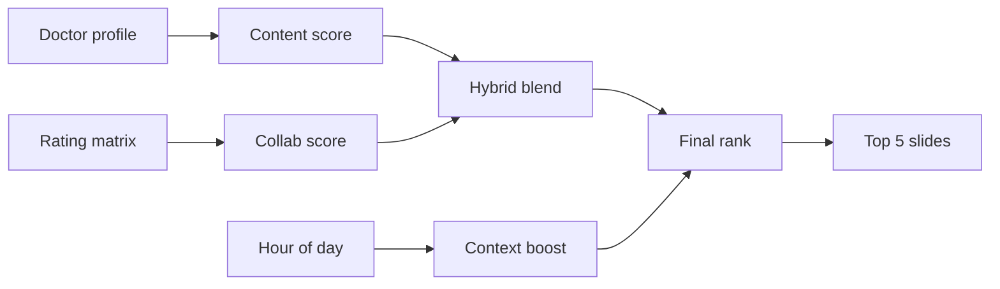

# MedX - Keep doctors updated

> **The right medical article, for the right doctor, at the right time.**

[](https://med-x-plum.vercel.app)
[](https://www.python.org/)
[](https://fastapi.tiangolo.com/)
[](https://scikit-learn.org/)

**[Live app](https://med-x-plum.vercel.app)** · **[API docs](https://med-x-plum.vercel.app/docs)** · **[GitHub](https://github.com/wasimahmadpk/MedX)**

Hybrid medical content recommender — **content + collaborative filtering + time-of-day context** — with a carousel web UI and REST API. Deployed on Vercel as a portfolio PoC.

---

## At a glance

| | |
|---|---|
| **Problem** | Surface the right article for a doctor's specialty, peers, and available time |
| **Output** | Up to **5** ranked recommendations per doctor |
| **UI** | Slide carousel (one card per slide), article modal, α slider, reading history |
| **Stack** | FastAPI · scikit-learn · NumPy SVD · **LightGBM LambdaRank** · pandas |
| **Data** | 15 doctors · 40 articles · 94 ratings · **319 event logs** (synthetic) |

---

## Contents

- [Features](#features)
- [Why MedX](#why-medx)
- [MedX vs full HCP platforms](#medx-vs-full-hcp-platforms-eg-coliquio)
- [Interview & portfolio](#interview--portfolio)
- [Algorithms](#algorithms-implemented)
- [Live demo](#live-demo)
- [How it works](#how-it-works)
- [Tech stack](#tech-stack)
- [Quick start](#quick-start)
- [API](#api)
- [Dataset](#dataset)
- [FAQ](#faq)
- [Project structure](#project-structure)
- [Deploy](#deploy)
- [Author](#author)

---

## Features

| Area | What you get |
|---|---|
| **Hybrid engine** | TF-IDF content scores + mean-centred NumPy SVD, blended with α |
| **LightGBM ranker** | LambdaRank locally; **sklearn GBR fallback** embedded in `.py` for Vercel |
| **Event logs** | Synthetic impressions, clicks, reads with **hour**, dwell time, day of week |
| **Context-aware** | Re-ranks by hour — quick lunch reads at noon, deeper articles in the evening |
| **Carousel UI** | Full-width slides with prev/next arrows, dot indicators, and position counter |
| **Article modal** | Summary, complexity, read time, and similar articles on click |
| **Algorithm controls** | Live α slider — compare content-based vs collaborative weighting |
| **REST API** | Same logic as the UI; interactive Swagger at `/docs` |
| **Serverless-ready** | Frontend embedded in `main.py`; no scikit-surprise or static file bundling issues |

---

## Why MedX

Doctors are overloaded with literature. A useful recommender must solve three problems at once:

| Signal | Question | Method |
|---|---|---|
| **Relevance** | Does this fit the doctor's specialty? | TF-IDF + cosine similarity |
| **Behaviour** | Do peers with similar tastes read this? | SVD collaborative filtering |
| **Timing** | Can they read it *now*? | Context-aware re-ranking |

**Why hybrid?** Content-only misses cross-specialty discoveries. Collaborative-only fails for new doctors with no history. MedX blends both, then adjusts for the hour.

| Approach | Strength | Weakness |
|---|---|---|
| Content-based only | Works for new users | Misses behavioural patterns |
| Collaborative only | Finds hidden patterns | Cold-start problem |
| **MedX hybrid + context** | Specialty + behaviour + timing | Prototype-scale data |

---

## MedX vs full HCP platforms (e.g. coliquio)

[coliquio](https://www.coliquio.de) is a DACH **doctor-only** network: verified identity, peer forums on patient cases, CME, medical news, guideline updates, and pharma **Infocenters** (HWG-compliant, separate from doctor-to-doctor discussion). It positions itself as a **personal information assistant** — relevant knowledge plus collegial exchange for licensed physicians and psychotherapists.

**MedX does not replicate that product.** It isolates one hard slice: **ranking which articles to show whom, and when** — as a deployable ML PoC you can demo, test via API, and discuss in interviews.

| Capability | Full platform (coliquio-style) | MedX prototype |
|---|---|---|
| **Verified HCP identity** | Approbation, login, compliance | ❌ Dropdown picks a synthetic doctor |
| **Peer forum / cases** | Patient cases, diagnoses, therapy threads | ❌ |
| **CME & events** | Credits, live/on-demand training | ❌ |
| **Pharma / Infocenters** | Sponsored product & study info (regulated) | ❌ |
| **Editorial & news pipeline** | Daily medical news, guideline alerts | ❌ Static 40 articles in seed data |
| **Personalised article feed** | Core product goal | ✅ Hybrid CF + content + time re-rank |
| **Explainable blend** | Often opaque in production | ✅ α slider (content ↔ collaborative) |
| **Time-of-day fit** | Likely learned from engagement at scale | ✅ Rule-based (length & complexity vs hour) |
| **Similar articles** | Related content widgets | ✅ TF-IDF cosine on tags/specialty/type |
| **REST API / MLOps path** | Internal services | ✅ FastAPI + `/docs`, Vercel deploy |

### What MedX deliberately simplifies

- **No timestamps on reads** — collaborative filtering uses ratings only, not “read at 20:00”. Time rules use the clock + article metadata, not temporal CF.
- **No real text mining** — `title` / `summary` are not in the TF-IDF model; only `tags`, `specialty`, `type`.
- **Hand-set `complexity_score`** — not computed from full text; stands in for a production readability/difficulty model.
- **Tiny synthetic graph** — 15 doctors and 94 ratings; patterns are illustrative, not statistically stable.

### What you could add next (production-shaped extensions)

| Extension | Why it matters on an HCP platform |
|---|---|
| Timestamped interactions | Enables **temporal collaborative filtering** (“peers like you read this in the evening”) |
| Session / device context | Mobile vs desktop, ward vs clinic |
| Forum + article graph | Recommend threads, cases, and papers in one feed |
| CME goals & credits | Boost content that completes a learning path |
| Compliance filters | HWG, specialty-only pharma, opt-out of sponsored slots |
| RAG over full text | Search + recommend from PDFs/guidelines, not just tags |
| A/B tests & logging | Measure lift on click-through, dwell time, CME completion |

**Interview framing:** *“MedX prototypes the recommender core of an HCP information assistant — hybrid relevance and time-aware re-ranking — while a live platform like coliquio layers community, CME, identity, and regulated pharma content around that engine.”*

---

## Interview & portfolio

MedX is scoped as a **recommender-engine PoC**, not a full HCP platform — enough to discuss hybrid design, trade-offs, and production next steps in ML / DS interviews.

**90-second pitch**

> Doctors see too much content and too little time. MedX ranks medical articles for a given doctor using three signals: specialty and tags (content-based TF-IDF), what similar doctors rated (collaborative SVD), and whether the article fits the current time slot (length and complexity vs lunch vs evening). You can tune the blend live with α and see up to five results in a carousel. It’s deployed on Vercel with a public API — synthetic data, but production-style algorithms.

**Likely questions & honest answers**

| Question | Answer |
|---|---|
| Is this temporal collaborative filtering? | **No.** Time is rule-based on article metadata; CF has no timestamps. |
| How is `complexity_score` computed? | **Hand-set** in seed data for the demo; production would use NLP or behaviour. |
| How would you evaluate it? | Hold-out ratings → precision/recall@k or NDCG; then online A/B on CTR/dwell. |
| Cold start? | Content-based + specialty helps new doctors; collab needs ratings history. |
| Why not LightFM / surprise? | NumPy SVD keeps the Vercel deploy small and dependency-free. |

**Demo in an interview:** [Live app](https://med-x-plum.vercel.app) → pick `d1` → Get Recommendations → move α → run lunch vs evening `curl` commands below.

---

## Algorithms implemented

| Component | Algorithm | Library | Role |
|---|---|---|---|
| Content-based | TF-IDF (1–2 grams) + cosine similarity | scikit-learn | Doctor profile vs articles (`tags`, `specialty`, `type`) |
| Collaborative | Mean-centred matrix factorisation (SVD, **10 factors**) | NumPy | Predict ratings from doctor–article interactions |
| Hybrid fallback | Weighted sum after min–max normalisation | — | When ranker off or no `hour` |
| **Ranker** | **LightGBM LambdaRank** | LightGBM | List order from 15 log + content features |
| Similar items | Cosine similarity on article TF-IDF vectors | scikit-learn | Modal “similar articles” |

**Ranker features (15):** content/collab scores, α, specialty match, complexity, read time, context boost, hour, impressions, reads, peer reads at hour, lunch share, dwell time.

**Not implemented:** separate temporal CF model, deep learning, RAG, online A/B tests.

---

## Live demo

**→ [med-x-plum.vercel.app](https://med-x-plum.vercel.app)**

| Step | Action |
|---|---|
| 1 | Select a doctor from the sidebar |
| 2 | Click **Get Recommendations** |
| 3 | Browse the **carousel** — arrows and dots move between up to 5 slides |
| 4 | Move the **α slider** to shift content-based ↔ collaborative weighting |
| 5 | Read the **context banner** (e.g. Lunch Break) — ranking uses your browser's local hour |
| 6 | Click a slide for the detail modal and similar articles |
| 7 | Open **All Articles** or **Reading History** to explore the dataset |

**Sample doctors**

| ID | Doctor | Specialty | Good for |
|---|---|---|---|
| `d1` | Dr. Anna Müller | Cardiology | Cardiology-heavy feed |
| `d2` | Dr. Ben Schäfer | Neurology | Neurology + cross-specialty picks |
| `d8` | Dr. Hans Weber | General practice | Broad primary-care content |
| `d10` | Dr. Jonas Schulz | Psychiatry | Mental-health articles |

**Compare context ranking** — same doctor, different hours:

```bash
curl -s "https://med-x-plum.vercel.app/api/recommend/d1?n=5&hour=12" | jq '.recommendations[].title'
curl -s "https://med-x-plum.vercel.app/api/recommend/d1?n=5&hour=20" | jq '.recommendations[].title'
```

---

## How it works



```
hybrid  = α · content + (1 − α) · collaborative
final   = hybrid × context_boost(complexity, read_time, hour)
```

| Layer | Tech | Purpose |
|---|---|---|
| Content-based | scikit-learn | Match tags, specialty, reading history |
| Collaborative | NumPy SVD (10 factors) | Predict from doctor–article ratings |
| Hybrid blend | α ∈ [0, 1] | Balance both signals |
| **Learning-to-rank** | **LightGBM LambdaRank** | Final order from 15 log + content features |
| Context re-rank | Rule-based time slots | In hybrid fallback; also a ranker feature |

**Time slots** (from `recommender/engine.py`)

| Slot | Hours | Ideal complexity | Max read (min) |
|---|---|---:|---:|
| Early Morning | 5–9 | 0.8 | 20 |
| Morning Work | 9–12 | 0.6 | 10 |
| **Lunch Break** | 12–14 | 0.3 | 5 |
| Afternoon Work | 14–18 | 0.55 | 9 |
| Evening | 18–22 | 0.8 | 20 |
| Late Night | 22–24 | 0.4 | 6 |
| Night | 0–5 | 0.4 | 6 |

**Specialties:** cardiology · neurology · oncology · pediatrics · dermatology · general practice · psychiatry · radiology

---

## Tech stack

| Layer | Choice | Notes |
|---|---|---|
| API | FastAPI + Uvicorn | Lazy-loaded recommender singleton |
| ML | scikit-learn, NumPy | TF-IDF + cosine sim; pure NumPy SVD (no surprise) |
| Data | pandas | In-memory seed data |
| UI | Embedded HTML/CSS/JS | Single `_HTML` string in `main.py` for Vercel |
| Hosting | Vercel Python runtime | `vercel.json` routes all paths to `main.py` |

---

## Quick start

```bash
git clone https://github.com/wasimahmadpk/MedX.git
cd MedX
python -m venv venv && source venv/bin/activate   # Windows: venv\Scripts\activate
pip install -r requirements.txt
uvicorn main:app --reload
```

Open [http://localhost:8000](http://localhost:8000) · Requires **Python 3.11+**

```bash
# Smoke test
curl http://localhost:8000/api/health
curl "http://localhost:8000/api/recommend/d1?n=5&alpha=0.5&hour=12"
```

---

## API

| Method | Endpoint | Description |
|---|---|---|
| `GET` | `/` | Web UI |
| `GET` | `/api/recommend/{id}` | Personalised recommendations |
| `GET` | `/api/doctors` | All doctors |
| `GET` | `/api/doctors/{id}` | Profile + reading history |
| `GET` | `/api/articles` | All articles |
| `GET` | `/api/articles/{id}` | Single article |
| `GET` | `/api/articles/{id}/similar` | Similar articles (TF-IDF) |
| `GET` | `/api/health` | Health check |
| `GET` | `/docs` | Swagger UI |

**`GET /api/recommend/{id}`**

| Param | Default | Description |
|---|---|---|
| `n` | `5` | Max 5 results |
| `alpha` | `0.5` | Content weight (0 = collab, 1 = content) |
| `hour` | server UTC | 0–23 for context ranking; UI sends browser local hour |
| `exclude_read` | `true` | Skip articles the doctor already rated |
| `use_ranker` | `true` | Use LightGBM when model loaded and `hour` set; else hybrid fallback |

```bash
curl "https://med-x-plum.vercel.app/api/recommend/d1?n=5&alpha=0.5&hour=12"
curl "https://med-x-plum.vercel.app/api/recommend/d1?n=5&alpha=0.5&hour=20"
```

<details>
<summary>Sample JSON response</summary>

```json
{
  "doctor": { "name": "Dr. Anna Müller", "specialty": "cardiology" },
  "context": {
    "hour": 12,
    "label": "Lunch Break",
    "icon": "🍽️",
    "ideal_complexity": 0.3,
    "max_reading_min": 5
  },
  "recommendations": [
    {
      "title": "Vitamin D Deficiency in Primary Care: Test or Treat?",
      "reading_time_minutes": 4,
      "complexity_score": 0.3,
      "score": 0.61
    }
  ]
}
```

</details>

---

## Datasets

Synthetic demo data in `data/seed_data.py`:

| Entity | Count |
|---|---:|
| Doctors | 15 |
| Articles | 40 |
| Lunch-friendly quick reads (≤5 min) | 14 |
| Ratings (1–5) | 94 |
| **Event logs** | **319** |

**Event log fields:** `doctor_id`, `article_id`, `event_type` (`impression` \| `click` \| `read_complete`), `hour`, `day_of_week`, `dwell_seconds`.

**Retrain rankers (local):**

```bash
pip install -r requirements.txt -r requirements-dev.txt
python scripts/train_ranker.py
# → recommender/model_bundle.py      (LightGBM, local/dev)
# → recommender/sk_model_bundle.py   (sklearn, bundled for Vercel)
```

> **Vercel:** `lightgbm` is excluded from production `requirements.txt` (native libs crash serverless). The app loads the **sklearn ranker** from `sk_model_bundle.py` instead.

**Per-article fields** (used in UI and/or models):

| Field | In TF-IDF? | In time re-rank? | Notes |
|---|---|---|---|
| `id`, `title`, `summary` | — / display only | — | Title/summary not in ML features today |
| `tags`, `specialty`, `type` | ✅ | — | Content-based corpus |
| `complexity_score` | — | ✅ | Manual 0–1 label in seed data |
| `reading_time_minutes` | — | ✅ | Lunch slot prefers ≤5 min |

**Interactions:** `(doctor_id, article_id, rating)` — no read timestamp.

---

## FAQ

**What does the α slider do?**  
`α = 1` → pure content-based. `α = 0` → pure collaborative. Default `0.5` blends both.

**Why only 5 recommendations?**  
Focused curated feed — the UI shows one slide at a time instead of a long list.

**How does the carousel work?**  
Each recommendation is a full-width card inside the main panel. Navigation sits below the card (arrows + dots + “2 of 5” counter).

**Is the data real?**  
No — synthetic for demonstration. Algorithms are production-style; the dataset is not.

**Does context use machine learning?**  
Rule-based for now (time slot → ideal complexity & length). Production systems would learn from engagement data.

**Why NumPy SVD instead of scikit-surprise?**  
Smaller serverless bundle, no native deps, same matrix-factorisation idea — better fit for Vercel.

**MedX vs WebMD?**  
[WebMD](https://www.webmd.com) is **patient-facing** consumer health. coliquio (Medscape network) and MedX target **licensed HCPs** — clinical depth, specialty, and practice-time context.

**Is MedX enough for interviews?**  
Yes, as a **focused recommender demo** if you explain scope, limitations, and production extensions (see [MedX vs full HCP platforms](#medx-vs-full-hcp-platforms-eg-coliquio)).

---

## Project structure

```
MedX/
├── main.py                      # FastAPI + embedded carousel UI
├── recommender/
│   ├── engine.py                # Hybrid engine + ranker integration
│   ├── context.py               # Time slots + context_boost
│   ├── features.py              # Log + content feature builder
│   ├── ranker.py                # LightGBM load/predict
│   └── models/lgb_ranker.txt    # Pre-trained ranker (bundled for Vercel)
├── scripts/train_ranker.py      # Offline training script
├── data/seed_data.py            # Doctors, articles, interactions, EVENT_LOGS
├── vercel.json
└── requirements.txt
```

---

## Deploy

1. Fork or clone the repo  
2. Import at [vercel.com/new](https://vercel.com/new)  
3. Deploy — `vercel.json` is included; no env vars required  

```bash
npm i -g vercel && vercel --prod
```

Verify:

```bash
curl https://med-x-plum.vercel.app/api/health
# {"status":"ok","model":"hybrid (TF-IDF + numpy SVD)","version":"0.1.0"}
```

> **Note:** Static files in `public/` are not used on Vercel — the UI lives inside `main.py` because Vercel's Python builder only bundles `.py` files.

---

## Author

**Wasim Ahmad** — ML Engineer · Data Scientist

[Demo](https://med-x-plum.vercel.app) · [GitHub](https://github.com/wasimahmadpk) · [Portfolio](https://wasimahmadpk.github.io/portfolio/) · [LinkedIn](https://www.linkedin.com/in/wasim-ahmad-73293767)

---

<p align="center">
  <sub>Hybrid filtering · Matrix factorisation · Context-aware recommendation · Time-aware ranking</sub>
</p>
