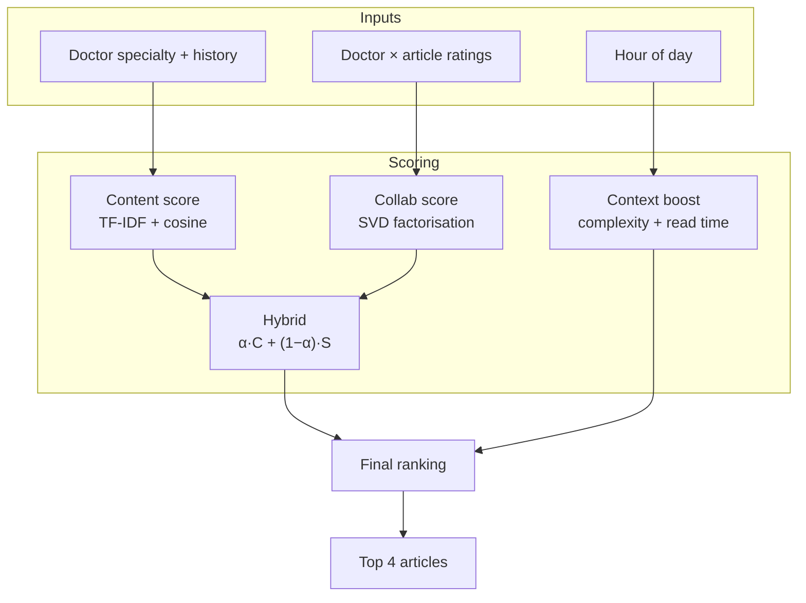

# MedX

**Personalised medical content for doctors — by specialty, behaviour, and time of day.**

[](https://med-x-plum.vercel.app)
[](https://www.python.org/)
[](https://fastapi.tiangolo.com/)
[](https://scikit-learn.org/)

**[Open live app →](https://med-x-plum.vercel.app)** · **[GitHub repo →](https://github.com/wasimahmadpk/MedX)**

MedX is a deployable hybrid recommender prototype: it ranks medical articles using **content similarity**, **collaborative filtering**, and **time-of-day context** — then serves up to **4** focused recommendations through a clean web UI.

---

## At a glance

| | |
|---|---|
| **Problem** | Doctors see too much content; relevance and timing both matter |
| **Approach** | Hybrid ML (TF-IDF + SVD) + context-aware re-ranking |
| **Output** | Max 4 personalised articles per doctor |
| **Stack** | FastAPI · scikit-learn · NumPy · Vercel |
| **Data** | 15 doctors · 40 articles · 94 ratings (synthetic) |

---

## Try it in 30 seconds

1. Open **[med-x-plum.vercel.app](https://med-x-plum.vercel.app)**
2. Pick a doctor — e.g. *Dr. Anna Müller · cardiology*
3. Click **Get Recommendations**
4. Move the **α slider** (content ↔ collaborative blend)
5. Click an article → summary, read time, complexity, similar items

The context banner shows your time slot (e.g. **Lunch Break**) and why articles fit *right now*.

---

## Features

- **Hybrid recommender** — TF-IDF content-based + SVD collaborative filtering  
- **Context-aware ranking** — short reads at lunch; deeper articles in the evening  
- **Tunable α** — live blend between content and collaborative signals  
- **Article modal** — read time, complexity bar, similar articles  
- **REST API** — Swagger docs at `/docs`  
- **Serverless deploy** — one-click on Vercel  

---

## How it works



**Formulas**

```
hybrid_score  = α · content + (1 − α) · collaborative
final_score   = hybrid_score × context_boost
```

| Stage | Method | Library |
|---|---|---|
| Content-based | TF-IDF on tags, specialty, type | scikit-learn |
| Collaborative | Mean-centred SVD (`R ≈ UΣVᵀ`) | NumPy |
| Context re-rank | Hour → ideal complexity & read length | Rule-based |

### Time slots

| Slot | Hours | Boosts |
|---|---|---|
| Early Morning | 05–09 | Long, complex |
| Morning Work | 09–12 | Medium |
| **Lunch Break** | **12–14** | **≤5 min, low complexity** |
| Afternoon | 14–18 | Medium |
| Evening | 18–22 | Long, complex |
| Night | 22–05 | Short |

---

## Run locally

**Requirements:** Python 3.11+

```bash
git clone https://github.com/wasimahmadpk/MedX.git
cd MedX
python -m venv venv && source venv/bin/activate
pip install -r requirements.txt
uvicorn main:app --reload
```

→ [http://localhost:8000](http://localhost:8000)

---

## API

| Method | Endpoint | Description |
|---|---|---|
| `GET` | `/` | Web UI |
| `GET` | `/api/recommend/{id}` | Recommendations (`n≤4`, `alpha`, `hour`) |
| `GET` | `/api/doctors` | List doctors |
| `GET` | `/api/doctors/{id}` | Profile + reading history |
| `GET` | `/api/articles` | All articles |
| `GET` | `/api/articles/{id}/similar` | Similar articles |
| `GET` | `/api/health` | Health check |
| `GET` | `/docs` | Interactive Swagger |

**Example**

```bash
curl "https://med-x-plum.vercel.app/api/recommend/d1?n=4&alpha=0.5&hour=12"
```

```json
{
  "context": { "label": "Lunch Break", "hour": 12, "max_reading_min": 5 },
  "recommendations": [
    {
      "title": "Vitamin D Deficiency in Primary Care: Test or Treat?",
      "reading_time_minutes": 4,
      "complexity_score": 0.3,
      "score": 0.61
    }
  ]
}
```

---

## Project structure

```
MedX/
├── main.py                 # FastAPI routes + embedded UI
├── recommender/engine.py   # Hybrid model + context re-ranker
├── data/seed_data.py       # Doctors, articles, interactions
├── vercel.json
└── requirements.txt
```

---

## Dataset

Synthetic demo data — each article has `complexity_score` (0–1) and `reading_time_minutes`.

| Entity | Count |
|---|---:|
| Doctors (8 specialties) | 15 |
| Articles | 40 |
| Lunch-friendly quick reads | 14 |
| Ratings | 94 |

---

## Deploy

Connect the repo at **[vercel.com/new](https://vercel.com/new)** — `vercel.json` included.

```bash
npm i -g vercel && vercel --prod
```

---

## Author

**Wasim Ahmad** — ML Engineer · Data Scientist

[Demo](https://med-x-plum.vercel.app) · [GitHub](https://github.com/wasimahmadpk) · [Portfolio](https://wasimahmadpk.github.io/portfolio/) · [LinkedIn](https://www.linkedin.com/in/wasim-ahmad-73293767)

---

<p align="center">
  <sub>Hybrid filtering · Matrix factorisation · Context-aware recommendation · Time-aware ranking</sub>
</p>
