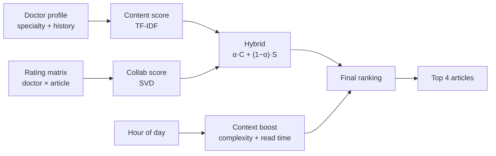

# MedX

**Hybrid medical content recommender — the right article, for the right doctor, at the right time.**

[](https://med-x-plum.vercel.app)
[](https://www.python.org/)
[](https://fastapi.tiangolo.com/)
[](https://vercel.com/)

**[Try the live app →](https://med-x-plum.vercel.app)**

---

## Contents

- [Why MedX](#why-medx)
- [Features](#features)
- [How it works](#how-it-works)
- [Quick start](#quick-start)
- [API](#api)
- [Dataset](#dataset)
- [Deploy](#deploy)
- [Author](#author)

---

## Why MedX

Doctors are flooded with medical literature. A useful recommender must answer three questions:

1. **Relevance** — Does this match the doctor's specialty and interests?
2. **Behaviour** — Do similar doctors find it valuable?
3. **Context** — Is now the right moment to read it (quick lunch read vs deep evening article)?

MedX implements all three in a deployable prototype: hybrid ML ranking plus **context-aware re-ranking** by time of day.

---

## Features

| Feature | Description |
|---|---|
| **Hybrid engine** | Content-based (TF-IDF) + collaborative filtering (SVD) |
| **Context-aware ranking** | Boosts short reads at lunch, deeper content in the evening |
| **Live α tuning** | Slider to blend content vs collaborative signals |
| **Article modal** | Summary, read time, complexity, similar articles |
| **Focused output** | Max **4** recommendations per request |
| **Full stack** | FastAPI backend, embedded UI, one-click Vercel deploy |

---

## How it works



### Stages

| # | Stage | Input | Method |
|---|---|---|---|
| 1 | Content-based | Tags, specialty, reading history | TF-IDF + cosine similarity |
| 2 | Collaborative | Doctor–article ratings | Mean-centred SVD (`R ≈ UΣVᵀ`) |
| 3 | Hybrid blend | Both scores | `α·content + (1−α)·collab` |
| 4 | Context re-rank | Hour, complexity, read time | Rule-based multiplier |

### Time-aware context

| Slot | Hours | What gets boosted |
|---|---|---|
| Early Morning | 05–09 | Long, complex |
| Morning Work | 09–12 | Medium |
| **Lunch Break** | **12–14** | **≤5 min, low complexity** |
| Afternoon | 14–18 | Medium |
| Evening | 18–22 | Long, complex |
| Night | 22–05 | Short |

The UI sends the browser's local hour automatically. Override via `?hour=12` on the API.

### Prototype vs production

| | MedX (this repo) | Production-scale system |
|---|---|---|
| Base model | TF-IDF + SVD | LightFM, deep rankers, etc. |
| Time logic | Rule-based slots | Learned from engagement data |
| Session / recency | — | Session models, time decay |
| Evaluation | Interactive demo | A/B tests, CUPED, dwell time |

MedX demonstrates the **architecture and concepts**; a production system would add learned temporal features and experimentation at scale.

---

## Quick start

```bash
git clone https://github.com/wasimahmadpk/MedX.git
cd MedX
python -m venv venv && source venv/bin/activate   # Windows: venv\Scripts\activate
pip install -r requirements.txt
uvicorn main:app --reload
```

1. Open [http://localhost:8000](http://localhost:8000)
2. Select a doctor (e.g. **Dr. Anna Müller · cardiology**)
3. Click **Get Recommendations**
4. Try the **α slider** or click an article for details

---

## API

### Endpoints

| Method | Path | Description |
|---|---|---|
| `GET` | `/` | Web UI |
| `GET` | `/api/doctors` | All doctors |
| `GET` | `/api/doctors/{id}` | Profile + reading history |
| `GET` | `/api/recommend/{id}` | Personalised recs (max `n=4`) |
| `GET` | `/api/articles` | All articles |
| `GET` | `/api/articles/{id}/similar` | Similar articles |
| `GET` | `/api/health` | Health check |
| `GET` | `/docs` | Swagger UI |

### Parameters — `GET /api/recommend/{id}`

| Param | Default | Description |
|---|---|---|
| `n` | `4` | Number of results (max 4) |
| `alpha` | `0.5` | Content weight (0 = collab only, 1 = content only) |
| `hour` | auto | Hour 0–23 for context re-ranking |

### Example

```bash
curl "https://med-x-plum.vercel.app/api/recommend/d1?n=4&alpha=0.5&hour=12"
```

```json
{
  "doctor": { "name": "Dr. Anna Müller", "specialty": "cardiology" },
  "context": { "label": "Lunch Break", "hour": 12, "max_reading_min": 5 },
  "recommendations": [
    {
      "title": "Vitamin D Deficiency in Primary Care: Test or Treat?",
      "reading_time_minutes": 4,
      "complexity_score": 0.3,
      "score": 0.61
    }
  ]
}
```

---

## Dataset

Synthetic data for demo and development:

| | |
|---|---|
| Doctors | 15 across 8 specialties |
| Articles | 40 (guidelines, reviews, education, quick reads) |
| Lunch-friendly | 14 articles (≤5 min, complexity ≤ 0.35) |
| Ratings | 94 interactions (1–5 stars) |

Every article includes `complexity_score` and `reading_time_minutes`.

---

## Project layout

```
MedX/
├── main.py                 # FastAPI + embedded frontend
├── recommender/engine.py   # Hybrid model + context re-ranker
├── data/seed_data.py       # Doctors, articles, interactions
├── vercel.json
└── requirements.txt
```

**Stack:** FastAPI · scikit-learn · NumPy · Pandas · Vercel

---

## Deploy

Import [github.com/wasimahmadpk/MedX](https://github.com/wasimahmadpk/MedX) at [vercel.com/new](https://vercel.com/new) — no extra config needed.

```bash
npm i -g vercel && vercel --prod
```

---

## Author

**Wasim Ahmad**

[Live demo](https://med-x-plum.vercel.app) · [GitHub](https://github.com/wasimahmadpk) · [Portfolio](https://wasimahmadpk.github.io/portfolio/) · [LinkedIn](https://www.linkedin.com/in/wasim-ahmad-73293767)

---

<p align="center">
  <sub>Hybrid filtering · Matrix factorisation · Context-aware recommendation · Time-aware ranking</sub>
</p>
