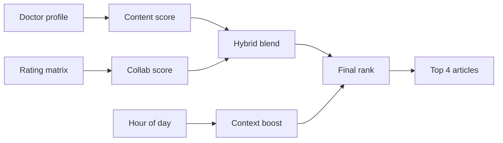

# MedX

> **The right medical article, for the right doctor, at the right time.**

[](https://med-x-plum.vercel.app)
[](https://www.python.org/)
[](https://fastapi.tiangolo.com/)
[](https://scikit-learn.org/)

**[Live app](https://med-x-plum.vercel.app)** · **[Source code](https://github.com/wasimahmadpk/MedX)** · **[API docs](https://med-x-plum.vercel.app/docs)**

Hybrid medical content recommender — ranks articles by **specialty**, **reading behaviour**, and **time of day**, then returns up to **4** focused recommendations.

---

## Contents

- [Overview](#overview)
- [Demo walkthrough](#demo-walkthrough)
- [Recommendation pipeline](#recommendation-pipeline)
- [Quick start](#quick-start)
- [API](#api)
- [Data](#data)
- [Deploy](#deploy)
- [Author](#author)

---

## Overview

Doctors face more medical content than they can read. MedX shows how a recommender can help by combining three signals:

| Signal | Question it answers | Technique |
|---|---|---|
| **Content** | Does this match the doctor's specialty & interests? | TF-IDF + cosine similarity |
| **Collaborative** | Do similar doctors value this article? | SVD matrix factorisation |
| **Context** | Is now a good moment to read it? | Time-of-day re-ranking |

**Example:** A cardiologist at **12:00 (lunch)** gets short, low-complexity reads. The same doctor at **20:00 (evening)** sees longer, in-depth articles — even with the same underlying hybrid score.

---

## Demo walkthrough

**Live:** [med-x-plum.vercel.app](https://med-x-plum.vercel.app)

1. Select a doctor → e.g. *Dr. Anna Müller · cardiology*
2. Click **Get Recommendations**
3. Adjust **α** — shift between content-based and collaborative ranking
4. Click any article — view summary, read time, complexity, similar items
5. Note the **context banner** — shows your current time slot (e.g. Lunch Break)

---

## Recommendation pipeline



```
hybrid  = α · content + (1 − α) · collaborative
final   = hybrid × context_boost(complexity, read_time, hour)
```

### Layers

| # | Layer | Library | Role |
|---|---|---|---|
| 1 | Content-based filtering | scikit-learn | Match articles to specialty & history |
| 2 | Collaborative filtering | NumPy SVD | Learn from doctor–article ratings |
| 3 | Hybrid blend | — | Combine both via tunable α |
| 4 | Context re-ranking | Rule-based | Boost articles that fit the hour |

### Time-aware slots

| Slot | Hours | Ideal content |
|---|---|---|
| Early Morning | 05–09 | Long, complex |
| Morning Work | 09–12 | Medium |
| **Lunch Break** | **12–14** | **≤5 min, simple** |
| Afternoon | 14–18 | Medium |
| Evening | 18–22 | Long, complex |
| Night | 22–05 | Short |

14 articles are tagged as **lunch-friendly** quick reads (≤5 min, low complexity).

---

## Quick start

**Requires:** Python 3.11+

```bash
git clone https://github.com/wasimahmadpk/MedX.git
cd MedX
python -m venv venv && source venv/bin/activate
pip install -r requirements.txt
uvicorn main:app --reload
```

Open [http://localhost:8000](http://localhost:8000)

---

## API

| Method | Endpoint | Description |
|---|---|---|
| `GET` | `/` | Web UI |
| `GET` | `/api/recommend/{id}` | Personalised recommendations |
| `GET` | `/api/doctors` | All doctors |
| `GET` | `/api/doctors/{id}` | Profile + reading history |
| `GET` | `/api/articles` | All articles |
| `GET` | `/api/articles/{id}/similar` | Similar articles (TF-IDF) |
| `GET` | `/api/health` | Health check |
| `GET` | `/docs` | Swagger UI |

**`GET /api/recommend/{id}` parameters**

| Param | Default | Description |
|---|---|---|
| `n` | `4` | Results count (max 4) |
| `alpha` | `0.5` | Content weight (0–1) |
| `hour` | browser time | Hour 0–23 for context ranking |

```bash
# Lunch-time recommendations for Dr. Anna Müller (cardiology)
curl "https://med-x-plum.vercel.app/api/recommend/d1?n=4&alpha=0.5&hour=12"
```

<details>
<summary>Sample response</summary>

```json
{
  "doctor": { "name": "Dr. Anna Müller", "specialty": "cardiology" },
  "context": {
    "hour": 12,
    "label": "Lunch Break",
    "icon": "🍽️",
    "max_reading_min": 5
  },
  "recommendations": [
    {
      "title": "Vitamin D Deficiency in Primary Care: Test or Treat?",
      "reading_time_minutes": 4,
      "complexity_score": 0.3,
      "score": 0.61
    }
  ]
}
```

</details>

---

## Data

Synthetic dataset for demonstration:

| | Count |
|---|---:|
| Doctors (8 specialties) | 15 |
| Articles | 40 |
| Lunch-friendly quick reads | 14 |
| Doctor–article ratings | 94 |

Each article includes `complexity_score` (0–1) and `reading_time_minutes`.

---

## Project structure

```
MedX/
├── main.py                 # FastAPI + embedded frontend
├── recommender/engine.py   # Hybrid model + context re-ranker
├── data/seed_data.py       # Doctors, articles, interactions
├── vercel.json             # Vercel config
└── requirements.txt
```

**Stack:** FastAPI · Uvicorn · scikit-learn · NumPy · Pandas · Vercel

---

## Deploy

Import at [vercel.com/new](https://vercel.com/new) — zero config, `vercel.json` included.

```bash
npm i -g vercel && vercel --prod
```

Verify: `curl https://med-x-plum.vercel.app/api/health`

---

## Author

**Wasim Ahmad** — Machine Learning Engineer · Data Scientist

[Demo](https://med-x-plum.vercel.app) · [GitHub](https://github.com/wasimahmadpk) · [Portfolio](https://wasimahmadpk.github.io/portfolio/) · [LinkedIn](https://www.linkedin.com/in/wasim-ahmad-73293767)

---

<p align="center">
  <sub>Hybrid filtering · Matrix factorisation · Context-aware recommendation · Time-aware ranking · Personalisation</sub>
</p>
