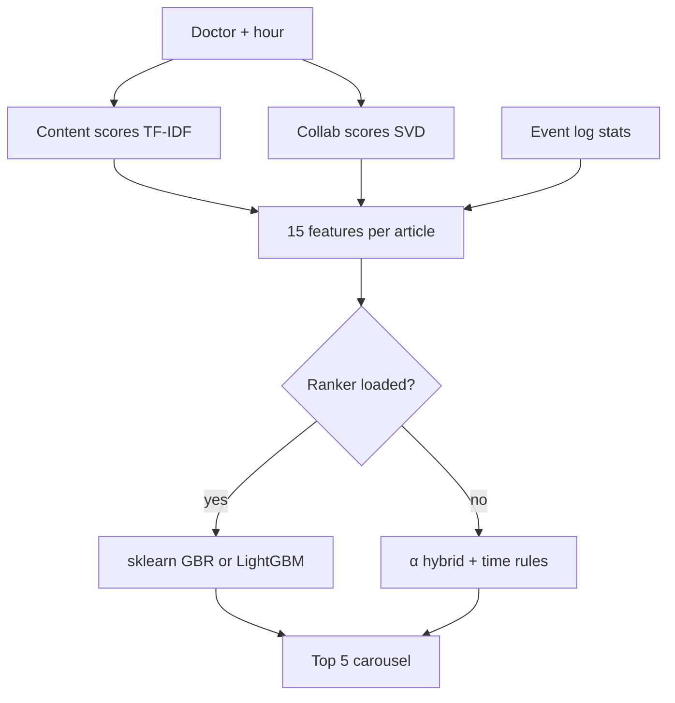

# MedX — Keep doctors updated

> **The right medical article, for the right doctor, at the right time.**

[](https://med-x-plum.vercel.app)
[](https://www.python.org/)
[](https://fastapi.tiangolo.com/)
[](https://scikit-learn.org/)

**[Live app](https://med-x-plum.vercel.app)** · **[API docs](https://med-x-plum.vercel.app/docs)** · **[GitHub](https://github.com/wasimahmadpk/MedX)**

MedX is a deployable **hybrid medical content recommender** for HCP-style feeds. It combines **TF-IDF content filtering**, **SVD collaborative filtering**, **synthetic event-log features**, and a **learned ranker** — served through a carousel UI and REST API on Vercel.

Standalone **MedX** prototype with no third-party branding in the UI.

---

## Try it now

**Web UI:** [med-x-plum.vercel.app](https://med-x-plum.vercel.app)

| Step | What to do |
|---|---|
| 1 | Pick a doctor → **Get Recommendations** |
| 2 | Swipe the **carousel** (up to 5 articles) |
| 3 | Drag **α** to shift content vs collaborative weight |
| 4 | Note the **context toast** (lunch vs evening; uses your local hour) |
| 5 | Open a slide → article modal + similar articles |
| 6 | Click **MedX** in the header to reset |

**Sample doctors:** `d1` cardiology · `d2` neurology · `d8` general practice · `d10` psychiatry

```bash
# Health check
curl -s https://med-x-plum.vercel.app/api/health | jq

# Lunch vs evening — compare ranked titles
curl -s "https://med-x-plum.vercel.app/api/recommend/d1?n=5&hour=12" | jq '.recommendations[].title'
curl -s "https://med-x-plum.vercel.app/api/recommend/d1?n=5&hour=20" | jq '.recommendations[].title'

# Force rule-based hybrid (no learned ranker)
curl -s "https://med-x-plum.vercel.app/api/recommend/d1?n=5&use_ranker=false" | jq '.ranker'
```

---

## At a glance

| | |
|---|---|
| **Problem** | Surface the right article for specialty, peers, and available time |
| **Output** | Top **5** ranked recommendations per doctor |
| **Retrieval** | TF-IDF content scores + mean-centred NumPy SVD |
| **Ranking** | **sklearn GBR** on Vercel · **LightGBM LambdaRank** locally (optional) |
| **Context** | Time-of-day rules + log patterns (hour, dwell, lunch share) |
| **Data** | 15 doctors · 40 articles · 94 ratings · **319 event logs** (synthetic) |
| **UI** | Carousel, article modal, α slider, reading history, context toast |

---

## How it works

Doctors are overloaded with literature. MedX answers three questions for every article:

| Signal | Question | Method |
|---|---|---|
| **Relevance** | Does this fit the doctor's specialty? | TF-IDF + cosine similarity |
| **Behaviour** | Do peers with similar tastes read this? | SVD matrix factorisation |
| **Timing** | Can they read it *now*? | Context features + log patterns by hour |

Content-only misses cross-specialty discoveries. Collaborative-only fails for new doctors. MedX combines both, then **learns list order** from log-derived features.



| Stage | Algorithm | Role |
|---|---|---|
| **1. Scoring** | TF-IDF + SVD | Relevance signals per article |
| **2. Features** | 15 log + content fields | Ranker input |
| **3. Ranking** | sklearn GBR (prod) / LightGBM (local) | Final list order |
| **4. Fallback** | α-blend × context boost | When ranker off or no `hour` |

```
features  = content, collab, α, specialty_match, complexity, read_time,
            context_boost, hour, log aggregates, dwell, …
ranker    = sklearn GBR(features)  →  top 5
fallback  = α·content + (1−α)·collab  ×  context_boost(hour)
```

**Time slots** (`recommender/context.py`)

| Slot | Hours | Ideal complexity | Max read (min) |
|---|---|---:|---:|
| Early Morning | 5–9 | 0.8 | 20 |
| Morning Work | 9–12 | 0.6 | 10 |
| **Lunch Break** | 12–14 | 0.3 | 5 |
| Afternoon Work | 14–18 | 0.55 | 9 |
| Evening | 18–22 | 0.8 | 20 |
| Late Night | 22–24 | 0.4 | 6 |
| Night | 0–5 | 0.4 | 6 |

---

## Features

| Area | What you get |
|---|---|
| **Hybrid retrieval** | TF-IDF content scores + mean-centred NumPy SVD collaborative scores |
| **Event logs** | Synthetic impressions, clicks, reads with **hour**, dwell time, day of week |
| **Learned ranker** | 15 features → **GradientBoostingRegressor** on Vercel; **LightGBM LambdaRank** locally |
| **Hybrid fallback** | α-blend + time rules if ranker disabled or no `hour` |
| **Context-aware** | Lunch vs evening fit via `complexity_score` and `reading_time_minutes` |
| **Carousel UI** | Full-width slides, dots, counter, article modal |
| **Context toast** | Auto-dismiss popup (~5s) after each recommendation fetch |
| **Home reset** | Click **MedX** logo to clear doctor, carousel, and modal |
| **Algorithm controls** | Live α slider (feeds ranker features + fallback blend) |
| **REST API** | Same logic as UI; Swagger at `/docs` |
| **Serverless-ready** | UI + ranker models embedded in `.py` files for Vercel |

---

## Algorithms

| Component | Algorithm | Where |
|---|---|---|
| Content-based | TF-IDF (1–2 grams) + cosine similarity | scikit-learn |
| Collaborative | Mean-centred SVD (**10 factors**) | NumPy |
| **Ranker (prod)** | GradientBoostingRegressor on 15 features | sklearn · Vercel |
| **Ranker (local)** | LambdaRank | LightGBM · `requirements-dev.txt` |
| Fallback | α-blend + `context_boost` | rules |
| Similar items | TF-IDF cosine | scikit-learn |

**15 ranker features:** content score, collab score, α, specialty match, complexity, read time, context boost, hour, article impressions/reads, reads at hour, peer reads at hour, doctor avg read hour, lunch share, dwell time.

**Production note:** Vercel runs `ranker_backend: "sklearn"`. LightGBM is excluded — native libs crash serverless.

---

## Quick start

**Requirements:** Python 3.11+

```bash
git clone https://github.com/wasimahmadpk/MedX.git
cd MedX
python -m venv venv && source venv/bin/activate   # Windows: venv\Scripts\activate
pip install -r requirements.txt
uvicorn main:app --reload
```

Open [http://localhost:8000](http://localhost:8000) · API docs at [http://localhost:8000/docs](http://localhost:8000/docs)

**Optional — train rankers locally:**

```bash
pip install -r requirements-dev.txt
python scripts/train_ranker.py
# writes recommender/model_bundle.py      (LightGBM)
#       recommender/sk_model_bundle.py    (sklearn — commit this for Vercel)
```

| Environment | Ranker | Notes |
|---|---|---|
| **Vercel (prod)** | sklearn GBR | Embedded in `sk_model_bundle.py` |
| **Local dev** | sklearn + LightGBM | LightGBM preferred when installed |
| **Fallback** | α hybrid + time rules | `use_ranker=false` or ranker not loaded |

---

## API

| Method | Endpoint | Description |
|---|---|---|
| `GET` | `/` | Web UI |
| `GET` | `/api/recommend/{id}` | Personalised recommendations |
| `GET` | `/api/doctors` | All doctors |
| `GET` | `/api/doctors/{id}` | Profile + reading history |
| `GET` | `/api/articles` | All articles |
| `GET` | `/api/articles/{id}/similar` | Similar articles |
| `GET` | `/api/health` | Status + `ranker_backend` |
| `GET` | `/docs` | Swagger UI |

**`GET /api/recommend/{id}`**

| Param | Default | Description |
|---|---|---|
| `n` | `5` | Max 5 results |
| `alpha` | `0.5` | Content weight (0 = collab, 1 = content) |
| `hour` | server UTC | 0–23; UI sends browser local hour |
| `exclude_read` | `true` | Skip already-rated articles |
| `use_ranker` | `true` | Use learned ranker when loaded |

<details>
<summary>Sample JSON response</summary>

```json
{
  "doctor": { "name": "Dr. Anna Müller", "specialty": "cardiology" },
  "ranker": "sklearn",
  "context": {
    "hour": 12,
    "label": "Lunch Break",
    "icon": "🍽️",
    "ideal_complexity": 0.3,
    "max_reading_min": 5
  },
  "recommendations": [
    {
      "title": "Vitamin D Deficiency in Primary Care: Test or Treat?",
      "reading_time_minutes": 4,
      "complexity_score": 0.3,
      "score": 2.41
    }
  ]
}
```

</details>

---

## Dataset

Synthetic data in `data/seed_data.py`:

| Entity | Count |
|---|---:|
| Doctors | 15 |
| Articles | 40 |
| Ratings (1–5) | 94 |
| Event logs | 319 |

**Event log fields:** `doctor_id`, `article_id`, `event_type` (`impression` | `click` | `read_complete`), `hour`, `day_of_week`, `dwell_seconds`.

**Article fields:** `tags`, `specialty`, `type` (TF-IDF) · `complexity_score`, `reading_time_minutes` (time/ranker) · `title`, `summary` (UI only).

**Interactions:** `(doctor_id, article_id, rating)` — no timestamp on ratings (logs carry hour).

---

## Tech stack

| Layer | Choice |
|---|---|
| API | FastAPI + Uvicorn |
| ML | scikit-learn 1.8.0, NumPy, pandas |
| Ranker (prod) | sklearn GBR in `sk_model_bundle.py` |
| Ranker (dev) | LightGBM in `requirements-dev.txt` |
| UI | Embedded HTML/CSS/JS in `main.py` |
| Hosting | Vercel Python (`vercel.json`) |

---

## Project structure

```
MedX/
├── main.py                         # FastAPI + embedded UI
├── recommender/
│   ├── engine.py                   # Hybrid engine + ranker orchestration
│   ├── context.py                  # Time slots + context_boost
│   ├── features.py                 # 15-feature builder + LogStats
│   ├── ranker.py                   # LightGBM (local)
│   ├── sklearn_ranker.py           # sklearn GBR (Vercel)
│   ├── model_bundle.py             # LightGBM text (local, auto-generated)
│   ├── sk_model_bundle.py          # sklearn pickle b64 (Vercel, auto-generated)
│   └── models/lgb_ranker.txt       # LightGBM file export
├── scripts/train_ranker.py         # Train both rankers
├── data/seed_data.py               # Doctors, articles, ratings, EVENT_LOGS
├── requirements.txt                # Production (no lightgbm)
├── requirements-dev.txt            # lightgbm for local training
└── vercel.json
```

---

## Deploy

1. Fork or clone → import at [vercel.com/new](https://vercel.com/new)
2. Ensure `recommender/sk_model_bundle.py` is committed (from `train_ranker.py`)
3. Deploy — no env vars required

```bash
npm i -g vercel && vercel --prod
curl -s https://med-x-plum.vercel.app/api/health | jq
```

Expected health response:

```json
{
  "status": "ok",
  "model": "hybrid (TF-IDF + numpy SVD) + learned ranker",
  "ranker_backend": "sklearn",
  "ranker_loaded": true,
  "ranker_detail": { "lightgbm": "not installed on Vercel" },
  "event_logs": 319,
  "version": "0.2.1"
}
```

> **Vercel bundles `.py` only** — UI and ranker models are embedded Python strings, not separate asset files.

---

## Scope & limitations

MedX is a **recommender PoC**, not a full HCP platform. It does not include verified login, forums, CME, or regulated content workflows.

| Capability | Full HCP platform | MedX PoC |
|---|---|---|
| Verified HCP login | ✅ | ❌ dropdown doctor |
| Peer forum / cases | ✅ | ❌ |
| CME & events | ✅ | ❌ |
| Personalised article feed | ✅ | ✅ hybrid + learned ranker |
| Explainable α blend | rare | ✅ slider |
| Event-log features | at scale | ✅ synthetic 319 events |
| REST API + live demo | internal | ✅ public |

**Evaluation today:** manual UI/API checks and lunch-vs-evening comparisons. Offline Recall@5 / NDCG@5 and automated tests are planned next steps.

<details>
<summary>Interview & portfolio talking points</summary>

**90-second pitch**

> Doctors see too much content and too little time. MedX retrieves articles with TF-IDF and collaborative SVD, builds features from synthetic engagement logs — impressions, clicks, reads by hour — and ranks the top five with a learned model on Vercel. You can tune the content/collaborative blend with α and compare lunch vs evening via the API. It's a deployable PoC with honest scope: synthetic data, production-style pipeline.

| Question | Answer |
|---|---|
| MF vs ranking? | SVD **scores**; ranker **orders** the list |
| Temporal CF? | **No** — logs add features; CF still rating-only |
| LightGBM on Vercel? | **No** — sklearn fallback; LightGBM for local dev |
| How evaluate? | Offline Recall@5 / NDCG@5; online A/B on CTR in production |
| MedX vs WebMD? | WebMD = patients; MedX = licensed-clinician feed prototype |

</details>

---

## FAQ

**What does the α slider do?**  
Feeds the ranker as a feature and controls hybrid fallback when `use_ranker=false`.

**Why sklearn on Vercel, not LightGBM?**  
LightGBM's native libs crash Vercel serverless. sklearn GBR ships as pure Python wheels in `sk_model_bundle.py`.

**Is this temporal collaborative filtering?**  
No. Logs provide **features** (reads at hour, peer patterns); SVD still uses ratings without timestamps.

**Why only 5 recommendations?**  
Focused feed — one carousel slide at a time.

---

## Author

**Wasim Ahmad** — ML Engineer · Data Scientist

[Demo](https://med-x-plum.vercel.app) · [GitHub](https://github.com/wasimahmadpk) · [Portfolio](https://wasimahmadpk.github.io/portfolio/) · [LinkedIn](https://www.linkedin.com/in/wasim-ahmad-73293767)

---

<p align="center">
  <sub>Hybrid filtering · Matrix factorisation · Learning-to-rank · Context-aware recommendation</sub>
</p>
